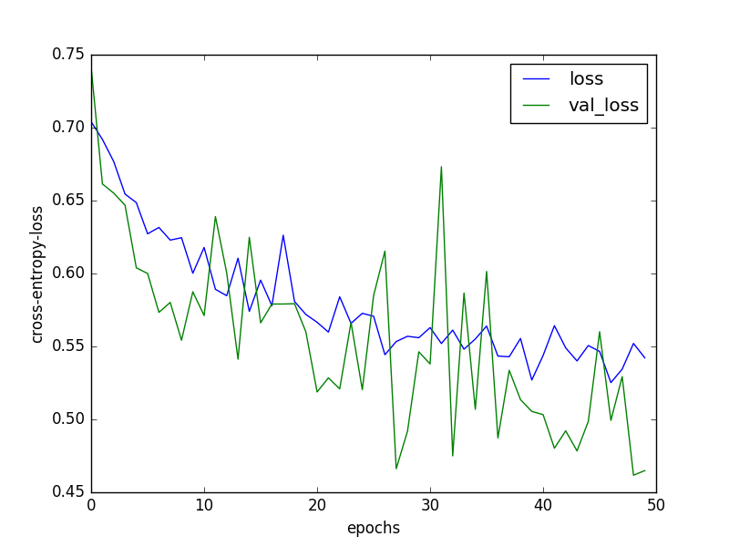
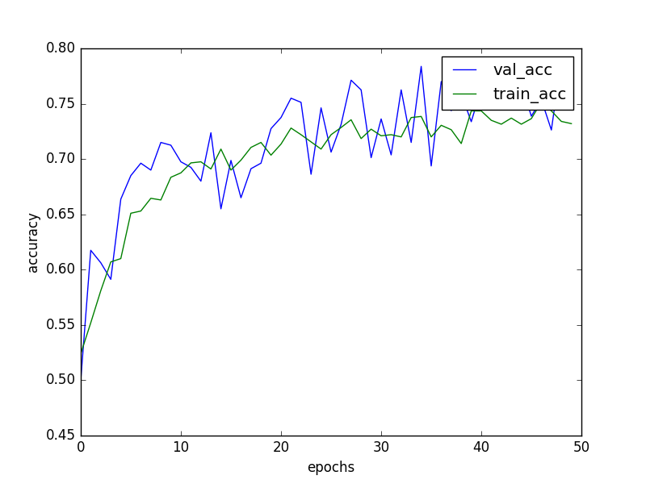
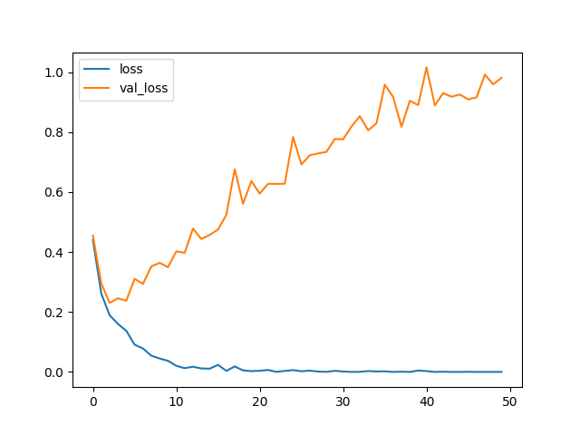
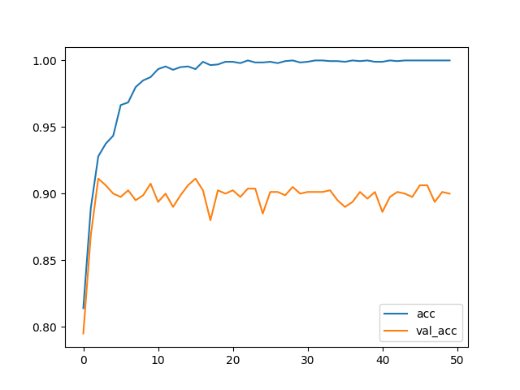
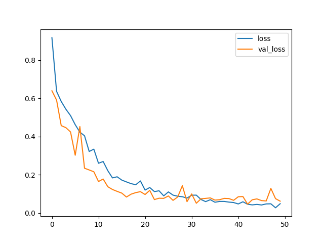
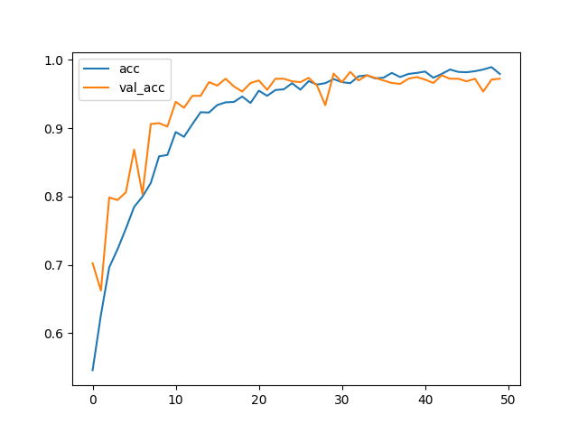

In this reposiory, I trained a small image dataset using Keras high level api. I used three approaches:

- Create a Convolutional Neural Network from scratch and train it
- Use the VGG16 to get the features of the images and train a fully-connected neural network on it
- Combine VGG16 and the trained MLP in the previous example and fine-tune the results

### The Data Set
The data set contains images of dogs and cats. The goal is to create a classifier that can distinguish between a cat image and a dog image. The training dataset containes 8000 images. 4000 images were cat and 4000 images were dog. The validation dataset consist of 800 images -- 400 dog images and 400 cat images. 

#### The Data Augmentation
I used the keras image-processing library for data augmentation. The keras image processing library can do different random transformations to an image such as horizontal flip, shear, zoom, horizontal and vertical translation are to name a few. Consequently, it can make the Conv-net robust to the real transformation that we see in the real world. Moreover, it makes the mini batch-gradient descent method unbiased by always sampling a new dataset from training. 
 
### Convolutional Neural Network from Scratch

- I trained a small conv-net using the data. 
- The images are cropped to size 150 * 150. 
- The conv-net has three hidden layers. The first layer has 32 filters and each of the size 3x3. The first layer is followed by a polling layer. The second layer has 32 filters each with size 3x3. A pooling layer followed the second layer. The third layer has 64 filters with size 3x3. A pooling layer followed the third layer. After that, I put a fully connected layer with $64$ hidden neurons. Subsequently, a fully-connected layer with one output neuron follows it. All the activation expect the output layer is ReLu. The activation of the output layer is Sigmoid. 
- Loss: the loss is binary cross entropy loss.
- **Results**     
Loss:



Accuracy:



#### Training Speed:
My model was processing 400 images / second. One training epoch took ~20 second on GPU and it took 130 seconds on CPU. 

#### Conclusion:
1. The training and validation accuracy is almost same which implies that the model is underfitting. This is not surprising because we are using a small conv-net for fitting the data. 

### Using features from VGG16 
I collected the features from VGG16 pooling layers for the train and validation dataset. The only pre-procesisng that I did in this case is to rescale the image bring all the pixel values between 0 and 1. I found computing the features from VGG16 net was very easy in Keras. It can be done in three lines of code.
```
from keras.applications import VGG16
model = VGG16(include_top=False, weights="imagenet")
data = model.predict_generator(data_generator, steps)
```
I saved the features generated by VGG16 net and trained a fully connected neural network on it. The neural network has only one hidden layer of size 64. I trained the model for 50 iterations and plotted the train and validation accuracy and loss in the following figures.

Loss:



Accuracy:



#### Conclusion:
It is clear from the above figure that using the features from VGG16 we are able to get 90% accuracy that is a huge improvement over 70% accuracy that we got using a small convnet. However, it is also evident that we have overfit the data by going through 50 iterations. Moreover we have overfit the data, but accuracy doesn't change much and remain fixed at 90%. 

### Fine Tuning the model
In this step, I created a new model in which I put a custom fully connected layer on top of VGG net. I only included the convolution layer of VGG net. On top of that I put the model that I trained previously using the features that I obtained from VGG16. Essentially, the top neural network has only one hidden layer with 64 neurons in it. I trained the model for 50 iterations. The train and validation accuracy and loss can be seen in the following figures.

Loss:



Accuracy:



#### Conclusion:
1. Using the fine tuned VGG16, we got the 97.5 percent validation accuracy.
2. The most important part of this exrcise was the optimizer. When I used the default "rmsprop" optimizer from keras, I got completely random results. The defult RMSprop optimizer has learning rate 0.001 and decay 0.9.
3. The above results I got using SGD with learning rate $1e-4$ and momentum $0.9$.
4. This was the first eperience where I saw so much change because of the learning rate. 
5. The training and validation accuracy are almost same and at the very end the training loss is less than the validation loss. One conclusion from that we are not overfitting. 

